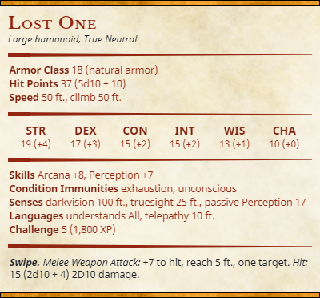

It is Extremly difficult to make this creature become agressive to you, if your party makes this thing angry. Dont hold its rolls back

## The Dragon
200HP

The Dragon is the physical manifestation of three souls merged together, The Great Mage of Altera, and the best two researchers from earth who were closest to the rift.

What happened, was when the Mage created the rift on his end, all that magic suddenly flooded the place on Earth where the Researchers had been standing. The tidal wave of magic merged the two humans together, while throwing the Dragonborn made into the mix, causing all three to merge and become one. 

The two human souls became severely altered by the magic, forcing the dragonborn's body to adapt to the new found amount of power, becoming what is known as The Dragon