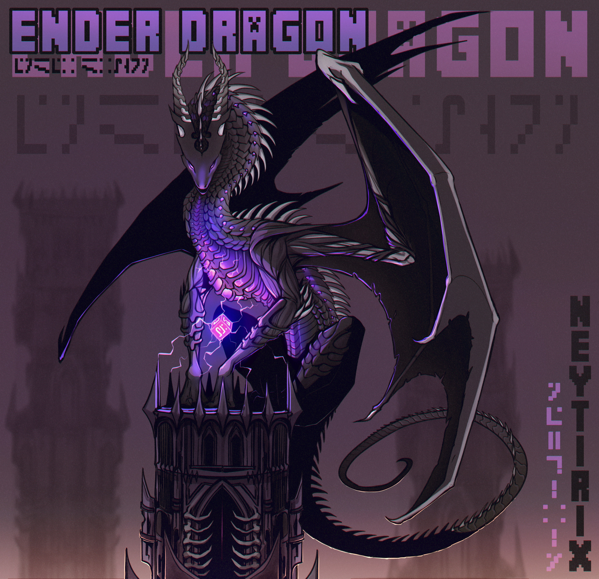

## Origins
The Lost Dragon was formed at the creation of the first Rift, the sphere of energy that links Altera to Earth. 

The Dragon was a special one, as it was born on Earth, yet it relied on Alteran magics to stay alive.

It existed on Earth for several years until it mysteriously vanished around the time the ISS was pulled into a rift.
The Vanished say that the Dragon left to find space to spread its wings, which the Vanished understood as the land where they stayed, was getting quite crowded.

The Dragon guarded the initial rift from all who got near, protecting humans from its corruptive traits, and protecting it from humans who wished to try and destroy it.

