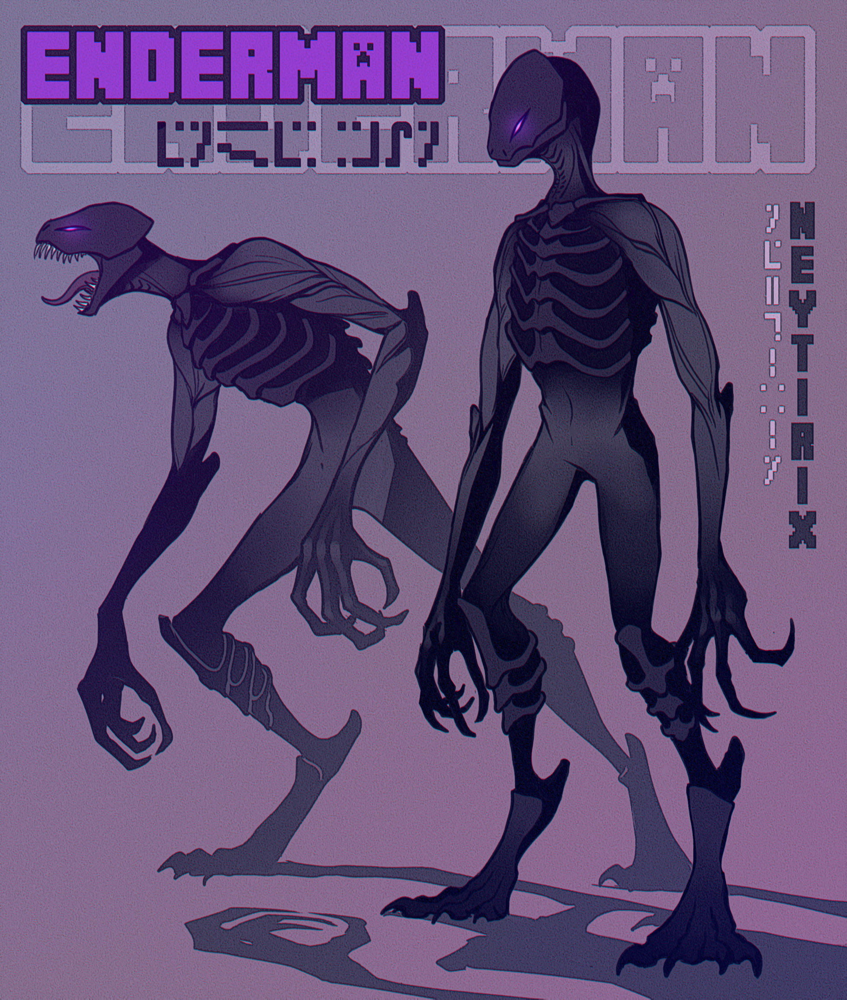

## Origins
It is unknown where the Lost Ones came from, some theorize that they are people who's resonance to thaumatic energy exceeded the theoretical limit. Others think they are a by product of the rifts, it is not really known.

The first recorded instance of a Lost One went as follows

A researcher who was trying to determine if the rifts were safe to be around almost stepped through before a large, clawed hand stopped him. The creature seemingly came from nowhere, and seemed adamant to prevent the scientist from getting closer than 10 feet to the rift.

## Appearence
These creatures appear to be humanoid, but with thick, dark grey skin.

Their legs are digigrade. Their bodies are thin and long. Standing 8ft tall on average, their eyes, glowing purple slits. their faces were smooth.

They do have a mouth, however when opened it revealed a set of teeth sharper than any other creature of the modern world. 

## Other Details
The Lost Ones are docile entities, and generally do not wish to harm the population of either world, they tend to stay to themselves, seperate from each other, occasionally interacting with people supposedly to learn more of their cultures.

There have been reported moments where a Lost One stopped a child from walking into a newly formed rift before the Guardians could get there. Suggesting they care for the lives of either world

They have no spoken language, and instead communicate telepathically by sending unknown glyphs to the one they wish to communicate with, Attempts to translate have proven fruitless. They do appear to understand common languages however and have aided others with attempts to understand their language by nodding, pointing, or shaking their heads.

